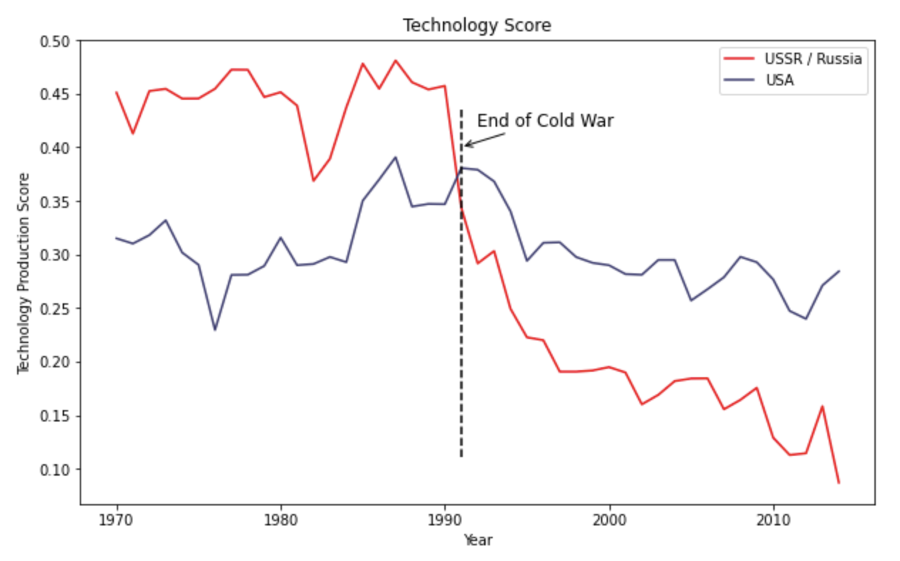
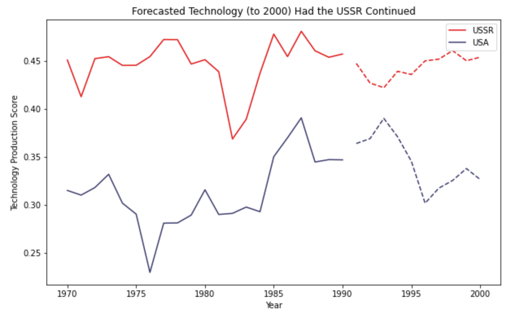
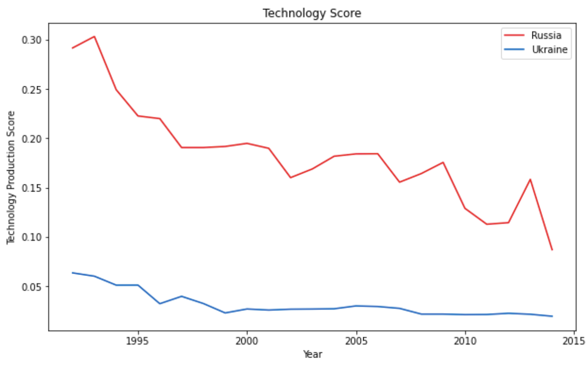

This month, I went to Berlin with a few friends to run in the Berlin marathon. I wanted to focus my studies this month somewhat around this trip, thinking it would give me something to look forward to seeing while I was there. I had also just finished a book called Chip War: The Fight for the World’s Most Critical Technology by Chris Miller, and thought that this technology was fascinating and something I wanted to dive deeper into. Therefore, with this in mind, I decided to begin by focusing on how chip technology impacted the Cold War. My idea was that the Berlin Wall is a large symbol of the end of the Cold War, and by researching this, I could maybe find some deeper meaning while I was walking along the East Side Gallery. And it did! This research evolved into me trying to understand the current conflict happening in Russia and Ukraine. I’m not sure I’ll try to elaborate on this subject anytime soon, but it was a very interesting topic to dive into for my first of these month-long research projects!

For 80 days in early 2022, Russia relentlessly bombed the Ukrainian port city Mariupol. Maternity wards, public shelters, theaters. All decimated. Both political figures and Amnesty International described these bombings as war crimes, but in a war-time environment, laws have been difficult to enforce. The city was taken in May of 2022 and has remained under Russian control ever since.

But, despite these large-scale attacks and its lesser economy and security, Ukraine has shown surprising resolve and military strength. Russia may have a larger arsenal, but Ukraine has kept pace due to advanced precision systems that allow them to target key buildings. These weapons were shown off just recently through an attack on military transport aircrafts in the Russian city of Pskov. Ukraine’s war efforts have been inspiring, but they’ve also been the result of the international condemnation of Russia’s antics. 

When Russia invaded Ukraine, countries around the world imposed sanctions and paused business with Russia. Some of these sanctions impacted daily life – Apple and Google turning off their pay options delayed the average citizen’s commutes early on in the war as crowds formed in the metro stations while people tried to find cash to pay for tickets. Some sanctions impact life in a more subtle way. Those sanctions have to deal with chip technology.

<blockquote class="twitter-tweet">
Apple Pay and Google Pay no longer work on Moscow&#39;s metro system, leading to long queues as people fumble about for cash <a href="https://t.co/ezaLZneKiJ">pic.twitter.com/ezaLZneKiJ</a>
&mdash; Jason Corcoran (@jason_corcoran) <a href="https://twitter.com/jason_corcoran/status/1498343208094478354?ref_src=twsrc%5Etfw">February 28, 2022</a></blockquote> 

I’m not the biggest weapons expert, but some articles have shown that the United States provided Ukraine with weapons called HIMARS, or High Mobility Artillery Rocket Systems. These have a range of around 50 miles and have fairly dependable accuracy, which allows Ukraine the ability to target and hit key locations deep into Russian territory. Because of these and similar weapons, Kyiv reported the destruction of at least 30 Russian logistic hubs. In comparison, Russia has a weapon called the MRLS, which seems to be similar but of lesser quality.

The gap in these weapons is due to chip technology. Chips are these small silicon wafers that have electronic circuits on them. These circuits turn on and off and essentially tell the chip what to do. The more circuits you can fit on a chip, the more the chip can do. Currently, these circuits are measured in nanometers. Our phones and computers and cars all have chips in them, and the quality of those chips dictate the quality of our technology. Weapons like HIMARS and MRLS use chips, and better chips with more circuits results in higher precision and a more effective weapon.

The reason that the United States can provide Ukraine with a weapon that is technologically superior to the weapons Russia can produce is because they have access to better chips. The reason the US has access to better chips at the moment deals a little with history and a little with the current global political climate. We’ll start with the political climate. 

Like I mentioned earlier, countries around the world have been imposing sanctions on Russia. One of these countries is Taiwan. Taiwan is a huge player when it comes to chips. This is because the world’s biggest and most advanced chip maker is Taiwan Semiconductor Manufacturing Company, located in (yeah) Taiwan. This chip manufacturer has what I believe to be the only machines in the world that can make the most advanced chips on the market today. All other chip manufacturers would need to invest an incredible amount of capital to build similar machines. Most, if not all, have just thrown their hands in the air. Therefore, these sanctions from Taiwan cut Russia off from the most advanced technology in the world. Meanwhile, most other countries, including Ukraine, have access to these chips and can build weaponry that utilizes this technology. 

Russia theoretically could build a factory with machinery that is capable of making the most advanced chips domestically. The information on how to do so is out there in the world. But doing so requires an enormous amount of money and expertise, and if this is even available, it would also take an enormous amount of time. By the time the machines are built and factories are complete, the war would probably be over and the industry would already be two or three steps further down the road. It seems like a losing battle, which is why I think Russia is currently settling for lesser quality weapons.

But Russia hasn’t always meant to settle for lesser quality or the international trade markets. If we look at the Cold War time period, we’ll see that the chip industry had a highly significant impact on the outcome of global tensions. 

Back in the day, many young Soviet students studied in the United States. US chip manufacturers like Texas Instrument and Fairchild were just heating up and competition for this technology was fierce. The Soviets recognized the impact chips were having on technology and encouraged, if not required that the Soviet students studying in America smuggle these chips back to their home country over holiday. Then, once this happened, the Soviet scientists were tasked with copying the chips one-for-one. Copying, I believe, worked with the Soviet’s nuclear weapon production. Why wouldn’t it work with chips? It wouldn’t work with chips because chip technology was advancing at such a rate that the chip technology was already outdated by the time the Soviets were able to copy it.

Engineers at TI and Fairchild were at the forefront of this technology. They had created chips, and they had all of the expertise when it came to chips. Therefore, they were the ones advancing the technology. And since they worked at private companies servicing an enormous non-governmental industry demand, things moved quickly. Breakthroughs were happening at an overwhelming pace, which maintained the gap between the newest product and what the Soviets could manage to copy. This ended up being so evidently an issue that, in 1983, the Soviets’ chief of the general staff, Marshal Nikolai Ogarkov, told American Leslie Gelb that “the Cold War is over and [the United States] has won.” 

The interesting thing about this and how it compares to today’s war is that the Soviet Union’s weaponry production far outdistanced the United States during the Cold War. If you look at the graph below, you’ll see that up until the end of the Cold War and the demise of the Soviet Union, the USSR’s production of military technology consistently surpassed the United States. 

If the Soviet Union had remained and the Cold War had continued, it is likely that this gap in production would have continued to persist. However, because of technology, the USSR still struggled to gain leverage.

Likewise, the same can be said with Russia today compared to Ukraine. They have a higher production but are struggling to compete due to a lack of technology. 

And as long as the world powers maintain this status quo, Ukraine will find success and Russia will continue to struggle.

Some sources:

https://www.theguardian.com/world/2023/apr/28/mariupol-before-and-after-updated-google-maps-reveal-destruction-in-ukraine-city

https://www.proquest.com/docview/2719273663?parentSessionId=2BwioWNit2QOtaaG43NgXyYorm%2FFNLtkKSlFw%2FSX498%3D&pq-origsite=primo&accountid=14667

https://www.nytimes.com/2023/02/23/world/europe/ukraine-mariupol-strike-weapons.html

https://www.wsj.com/world/europe/ukrainian-drones-strike-deep-inside-russia-hitting-military-airfield-other-targets-e42ca54

https://www.bbc.com/news/world-62512681

https://www.aljazeera.com/news/2022/7/26/the-russians-have-nothing-equivalent-how-himars-help-ukraine

https://financialpost.com/pmn/business-pmn/taiwan-says-it-will-join-democratic-countries-to-sanction-russia/wcm/feef127d-d99f-4ec4-b36c-8709cbca0b13/amp/

https://www.hoover.org/research/cold-war-over-and-you-have-won-semiconductors-and-revolution-military-affairs

_Chip War: The Fight for the World's Most Critical Technology_ by Chris Miller
